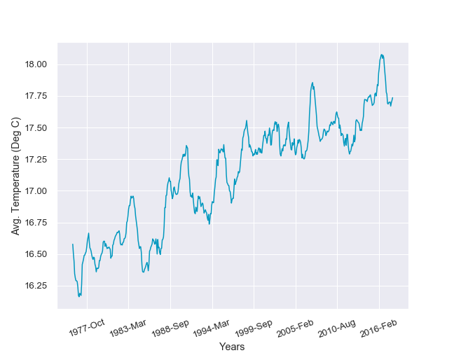
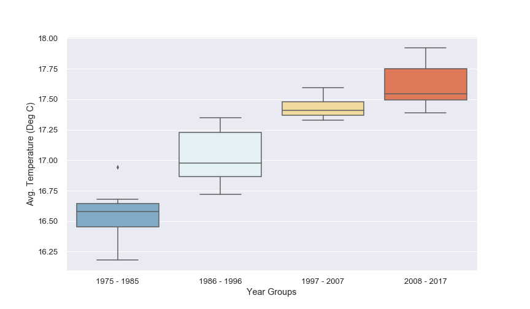
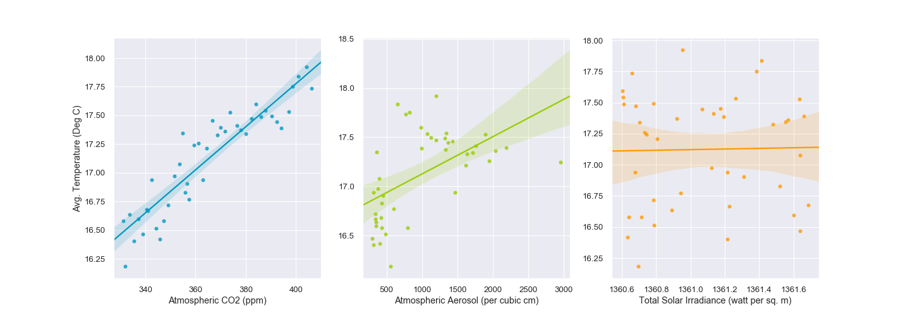

# Thermal_Warming
This project aims to study presence of global warming and analyse key factors that may contribute to it through analysis of Data obtained from NASA and NOAA sources. 

## This project examines and tries to
### - statistically prove that Global temperatures are rising
### - to derive correlation between CO2 , Solar radiation and Aerosol particles.

## Key steps are
 - Extraction of data from multiple FTP sources ( NASA, NOAA) in csv, JSON and .NAS formats
 - Data cleaning using Pandas involved
       - filtering data only after 1975
       - Interpolating missing values with row-wise mean for numerical values
       - Correcting data formats( eg. number string to floats etc.,)
       - Finally, cleaned Data was grouped and summarized 
## Analysis - Level 1:
 - First level of analysis was conducted by visualizing data using Seaborn Library. 
 - Simple time-series plots and scatter plots were created to understand global temperature trends.
 - The resulting plot is as below 
## Analysis - Level 2
- In the next level, Independent t-test and ANOVA was conducted to derive the p-value.
- The significance level (p-value) will help statistically prove that temperatures are rising
- 
## Analysis - Level 3
- In this level, correlation study was performed to understand what drives the temperature to rise. Three factors analysed were Atmospheric CO2, Total Solar Radiation and Aerosol Concentration
- Pearson Method of correlation was conducted to derive r-value
- 

